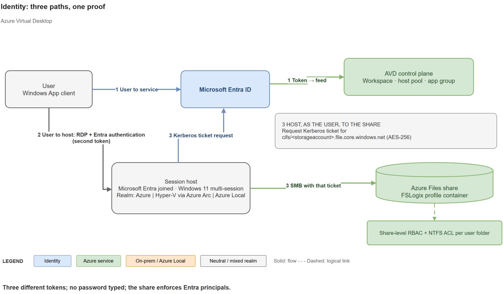

# Azure Virtual Desktop: Identity Reference Architecture

A reference for tracing identity from user sign-in through session-host access to an Azure Files profile share.

**Status:** prepared 2026-10-06 against Microsoft Learn; identity support changes by release and region, so re-check the linked documentation before you design.

## The three paths

The same user follows three paths and receives three different tokens; no password is typed.

1. **User to service.** The user signs in to Microsoft Entra ID from Windows App and gets a token for the Azure Virtual Desktop service, which returns the feed.
2. **User to host.** With single sign-on enabled, the user authenticates to the session host with a Microsoft Entra token issued through the Windows Cloud Login application, instead of typing credentials.
3. **Host, as the user, to the share.** The session host asks Microsoft Entra ID for a Kerberos ticket for the storage account (`cifs/<storageaccount>.file.core.windows.net`; with Microsoft Entra Kerberos the ticket encryption is always AES-256) and mounts the profile share over SMB. The share then enforces share-level RBAC plus NTFS ACLs per user folder.

A proof you can show: run `klist get cifs/<storageaccount>.file.core.windows.net`, then `klist` inside the session. It lists a cifs ticket from the Entra realm.

## Building blocks

**User identities**

- **Cloud-only:** created and managed only in Microsoft Entra ID. For Azure Files with Microsoft Entra Kerberos this is labelled preview in parts of Microsoft Learn (see the Azure Files section).
- **Hybrid:** AD DS identities synced to Microsoft Entra ID with Microsoft Entra Connect Sync or Microsoft Entra Cloud Sync.
- **External identities:** single sign-on must be enabled on the host pool, and Azure Files support for external identities is limited to FSLogix scenarios on Azure Virtual Desktop in the public cloud.

**Session hosts and access**

- Session hosts can be Microsoft Entra joined, hybrid joined or AD DS joined, depending on the deployment model (next section).
- Users need an eligible licence.
- On Microsoft Entra-joined session hosts, assign the Virtual Machine User Login role to users, and the Virtual Machine Administrator Login role to admins, on the VM or its resource group. A missing role gives the error "Your account is configured to prevent you from using this device".

## Join type by deployment model

| Model | Allowed join types | Notes |
|---|---|---|
| Azure | Microsoft Entra join with single sign-on; AD DS join and hybrid join are also supported | |
| Azure Local | AD DS join (including Microsoft Entra hybrid join) through the Azure Virtual Desktop portal; native Microsoft Entra join through PowerShell and other deployment methods | The portal can only add session hosts to an AD DS domain. Each host pool contains only Azure session hosts or only Azure Local session hosts. |
| Azure Virtual Desktop Hybrid | Windows client hosts: Microsoft Entra joined, AD DS joined or hybrid joined. Windows Server hosts: AD DS joined or hybrid joined | Entra-only join is not supported for Windows Server because of the Remote Desktop Services licensing server dependency. Windows multi-session editions are not supported on Hybrid. |

## Single sign-on and Conditional Access

Enabling single sign-on is five tasks:

1. Enable Microsoft Entra authentication for RDP.
2. Hide the consent prompt dialog.
3. Create a Kerberos server object if AD DS is part of the environment. It is required when a session host is hybrid joined, and when a session host is Microsoft Entra joined, domain controllers exist and users must reach on-premises resources such as SMB shares.
4. Review Conditional Access policies.
5. Configure the host pool for single sign-on.

Two Microsoft Entra applications are involved when single sign-on is on: **Azure Virtual Desktop** (feed subscription and gateway sign-in) and **Windows Cloud Login** (session host sign-in). Keep their Conditional Access policies aligned, or users see unexpected prompts. Verify in the Microsoft Entra sign-in logs that both applications show Success and the expected policy.

Cautions:

- Do not put the Azure Virtual Desktop Azure Resource Manager Provider application in any Conditional Access policy.
- Do not block the Windows 365 application: Windows App authenticates to it too.
- Disable legacy per-user MFA and use Conditional Access only.
- The Every time sign-in frequency is supported only on the Windows Cloud Login application.
- A device-compliance requirement on All cloud apps can block Microsoft Entra-joined session hosts, so scope such policies.
- If single sign-on is not enabled, Conditional Access for VM sign-in targets the Microsoft Azure Windows Virtual Machine Sign-in application.

## Azure Files and FSLogix identity

| Identity source | Fits | Note |
|---|---|---|
| AD DS | Clients that can reach domain controllers | Sync identities to Microsoft Entra ID for share permissions. |
| Microsoft Entra Domain Services | Cloud-only or hybrid identities; clients joined to the managed domain | |
| Microsoft Entra Kerberos | Cloud-first or hybrid; Microsoft Entra-joined clients; FSLogix; clients need no domain controller connectivity | Exclude the storage account application from MFA Conditional Access policies. For cloud-only identities, manage file and directory permissions with the Azure portal or RestSetAcls; editing permissions in File Explorer is not supported for them. |

A storage account uses only one identity source. Hybrid identities with Microsoft Entra Kerberos work in all clouds; cloud-only identities are supported in public cloud regions only. Microsoft Learn is not consistent about the status of cloud-only identities: the Microsoft Entra Kerberos introduction and the Azure Files what's-new page label the support as preview, while the Azure Files setup article describes it without a label. Treat it as preview and confirm the current status before you rely on it.

Microsoft Entra Kerberos setup:

1. Enable it on the storage account.
2. Grant admin consent to the generated application (`openid`, `profile` and `User.Read`).
3. Exclude that application from MFA policies.
4. Assign share-level permissions.
5. Configure directory and file permissions. For hybrid identities, File Explorer or `icacls` needs a device that can reach a domain controller.
6. On every client, set `CloudKerberosTicketRetrievalEnabled` to `1`: with the Intune settings catalog (not OMA-URI, which does not work on multi-session), Group Policy or the registry.
7. For FSLogix, also set `LoadCredKeyFromProfile` to `1` under the `AzureADAccount` policy key.
8. For cloud-only identities, add the `kdc_enable_cloud_group_sids` tag to the application manifest. A Kerberos ticket can carry at most 1,010 group SIDs.
9. Make sure the services `WinHttpAutoProxySvc` and `iphlpsvc` are running.

Two warnings from Microsoft Learn. A Windows update in April 2026 changes the default Kerberos encryption type from RC4 to AES-SHA1; file shares that host FSLogix containers must be upgraded to AES-SHA1 first, or access can fail. And error 1327 on `net use` means the storage application was not excluded from MFA.

## Azure Local cluster identity is a separate question

The Azure Local cluster's own identity model, for example Local Identity with Key Vault or AD DS, decides how the cluster nodes trust each other. It is chosen in the infrastructure plan and does not decide how users or session hosts authenticate. Session hosts on Azure Local can be Microsoft Entra joined or AD joined, whichever cluster identity you chose.

Local Identity with Key Vault is not passwordless: it needs a local administrator on the nodes and a Key Vault for the recovery secrets.

## Choosing a model

| Situation | Start with |
|---|---|
| Cloud-first, Windows client session hosts | Microsoft Entra-joined hosts, cloud-only or hybrid users, and Microsoft Entra Kerberos for profiles |
| Existing AD DS and Windows Server session hosts | AD DS or hybrid join, and AD DS authentication on Azure Files (or Microsoft Entra Kerberos for hybrid identities) |
| Azure Local or Hybrid hosts that must reach on-premises resources | Hybrid join, plus a Kerberos server object when single sign-on is on |

## Common questions

- **Do I need AD DS?** Not for Microsoft Entra-joined Windows client hosts with Microsoft Entra Kerberos. Windows Server hosts need AD DS or hybrid join.
- **Why do users see two prompts?** The two Conditional Access applications are not aligned, or per-user MFA is on.
- **Does MFA apply to the file share?** No. Exclude the storage account application; MFA happens at sign-in.
- **Can external users use it?** Single sign-on is required, and Azure Files support is limited to FSLogix on Azure Virtual Desktop.
- **Why can a user see the feed but not open the host?** The Virtual Machine User Login role may be missing, or the Windows Cloud Login application may be blocked.
- **Is the cluster identity the same as user identity?** No.

## Checklist

- [ ] Users and groups exist (cloud-only or synced).
- [ ] Eligible licences are assigned.
- [ ] The join type is chosen per deployment model.
- [ ] Roles are assigned on Microsoft Entra-joined hosts.
- [ ] Single sign-on is configured.
- [ ] Conditional Access covers both applications.
- [ ] Per-user MFA is disabled.
- [ ] The Azure Files identity source is chosen and enabled once.
- [ ] The storage application is consented and excluded from MFA.
- [ ] Client Kerberos settings are deployed.
